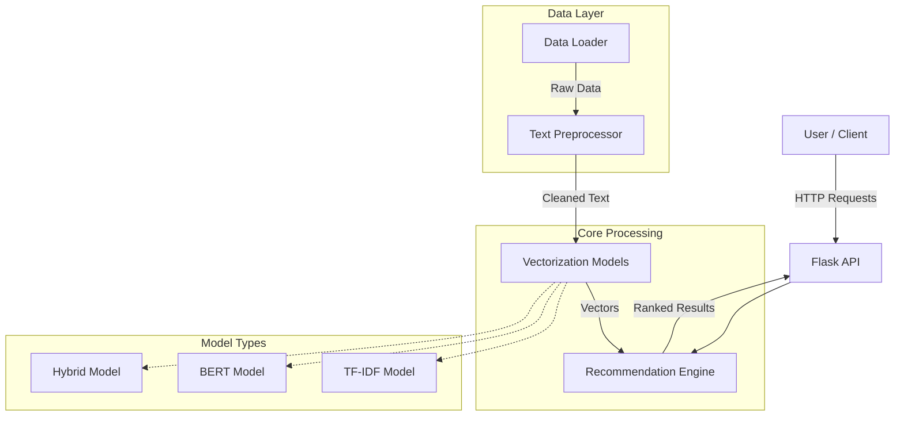
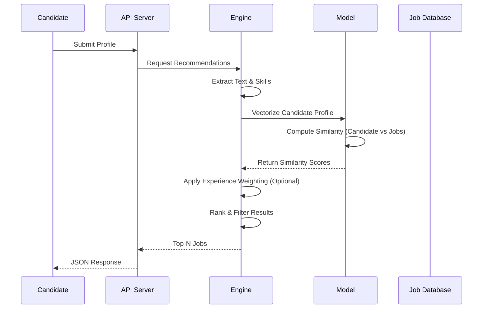

# AI-Powered Job Recommendation System

A scalable, model-agnostic job recommendation system designed to match candidate profiles with job descriptions using advanced NLP techniques. The system supports **TF-IDF**, **BERT**, and **Hybrid** models to balance performance and accuracy.

## 🚀 Key Features

*   **Multi-Model Engine**: Seamlessly switch between keyword-based (TF-IDF), semantic (BERT), and Hybrid recommendation strategies.
*   **Precision Matching**: Achieves high precision (Precision@1: 1.0000 with BERT) in synthetic tests.
*   **RESTful API**: Full-featured Flask API for integration with frontend applications.
*   **Robust Preprocessing**: Advanced NLP pipeline with spaCy and NLTK (tokenization, lemmatization, skill normalization).
*   **Comprehensive Evaluation**: Built-in tools to measure Precision@K, specific Recall, NDCG, and MRR.

## 🏗️ System Architecture

The system follows a modular architecture separating data ingestion, processing, modeling, and API layers.



## 🔄 Recommendation Flow

How a candidate profile gets matched to the best jobs:



## 📊 Performance Outcomes

We compared the **TF-IDF** (Baseline) and **BERT** (Semantic) models using synthetic ground truth data.

**Key Findings:**
*   **BERT** outperforms TF-IDF in identifying the single best match (**Precision@1: 100%** vs 85.7%).
*   **TF-IDF** remains robust for broader top-5 recommendations.
*   **Hybrid** mode (recommended for production) combines the exact keyword matching of TF-IDF with the semantic understanding of BERT.

| Metric | TF-IDF (Baseline) | BERT (Semantic) |
| :--- | :--- | :--- |
| **Precision@1** | 0.8571 | **1.0000** |
| **Precision@3** | 0.7619 | **0.9048** |
| **MRR** | 0.8929 | **1.0000** |

> [!NOTE]
> Results are based on synthetic data evaluation. Real-world performance may vary based on data quality.

## 🛠️ Installation & Usage

### 1. Setup

```bash
# Clone the repo
git clone https://github.com/Aryan717317/Job-Recommendation-System.git
cd Job-Recommendation-System

# Install dependencies
pip install -r requirements.txt
python -m spacy download en_core_web_sm
```

### 2. Run the Demo

See the system in action with auto-generated mock data:

```bash
python main.py demo
```

### 3. Start the API

```bash
# Run with the powerful Hybrid model
python main.py serve --model hybrid
```

The API will be available at `http://localhost:5000`.

### 4. Evaluate Models

```bash
python main.py evaluate --model hybrid
# Or compare models
python main.py compare
```

## 📂 Project Structure

```
job-recommendation-system/
├── api/                    # Flask REST API endpoints
├── config/                 # Centralized configuration
├── data/                   # Data loaders and Pydantic schemas
├── evaluation/             # Metrics (NDCG, Precision, Recall)
├── models/                 # TF-IDF, BERT, and Hybrid implementations
├── preprocessing/          # NLP text cleaning pipeline
├── recommender/            # Core recommendation engine logic
├── tests/                  # Unit tests
├── main.py                 # CLI entry point
└── requirements.txt        # Python dependencies
```

## 🧪 Documentation & Testing

*   **API Docs**: Endpoints are documented in the code.
*   **Testing**: Run `pytest tests/` to verify system integrity.

## 🔮 Future Roadmap

*   [ ] Front-end Dashboard (React/Streamlit)
*   [ ] Resume Parsing (PDF/Docx)
*   [ ] Real-time Feedback Loop
*   [ ] Production Deployment (Docker/Kubernetes)

---
**License**: MIT
